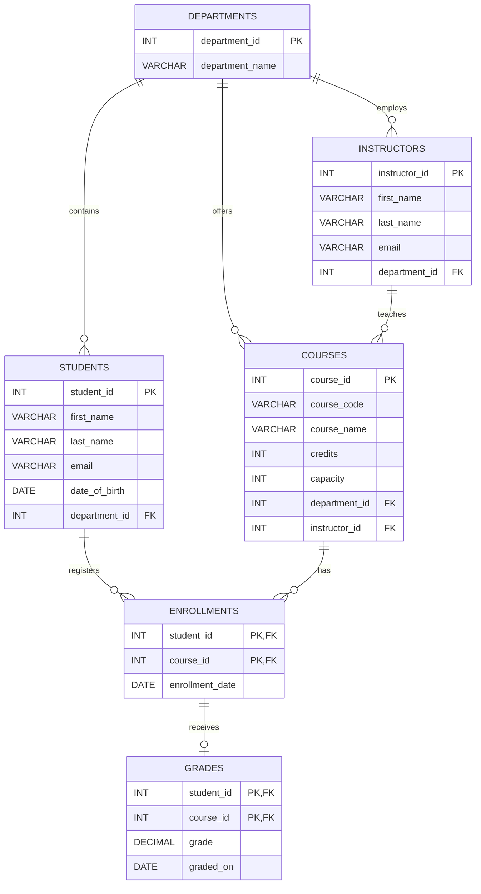

```mermaid
erDiagram

    DEPARTMENTS {
        INT department_id PK
        VARCHAR department_name
    }

    STUDENTS {
        INT student_id PK
        VARCHAR first_name
        VARCHAR last_name
        VARCHAR email
        DATE date_of_birth
        INT department_id FK
    }

    INSTRUCTORS {
        INT instructor_id PK
        VARCHAR first_name
        VARCHAR last_name
        VARCHAR email
        INT department_id FK
    }

    COURSES {
        INT course_id PK
        VARCHAR course_code
        VARCHAR course_name
        INT credits
        INT capacity
        INT department_id FK
        INT instructor_id FK
    }

    ENROLLMENTS {
        INT student_id PK, FK
        INT course_id PK, FK
        DATE enrollment_date
    }

    GRADES {
        INT student_id PK, FK
        INT course_id PK, FK
        DECIMAL grade
        DATE graded_on
    }

    DEPARTMENTS ||--o{ STUDENTS : contains
    DEPARTMENTS ||--o{ INSTRUCTORS : employs
    DEPARTMENTS ||--o{ COURSES : offers
    INSTRUCTORS ||--o{ COURSES : teaches
    STUDENTS ||--o{ ENROLLMENTS : registers
    COURSES ||--o{ ENROLLMENTS : has
    ENROLLMENTS ||--o| GRADES : receives
```